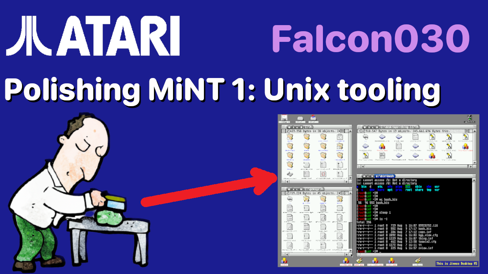
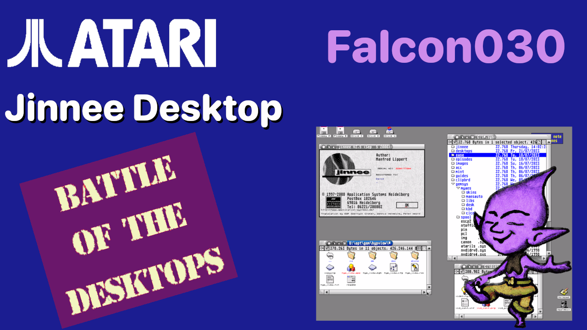
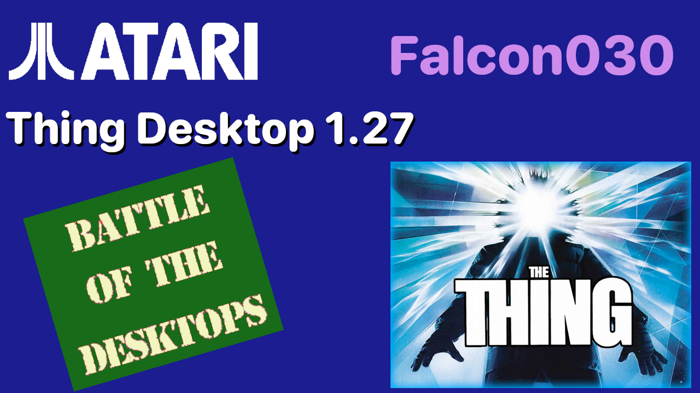
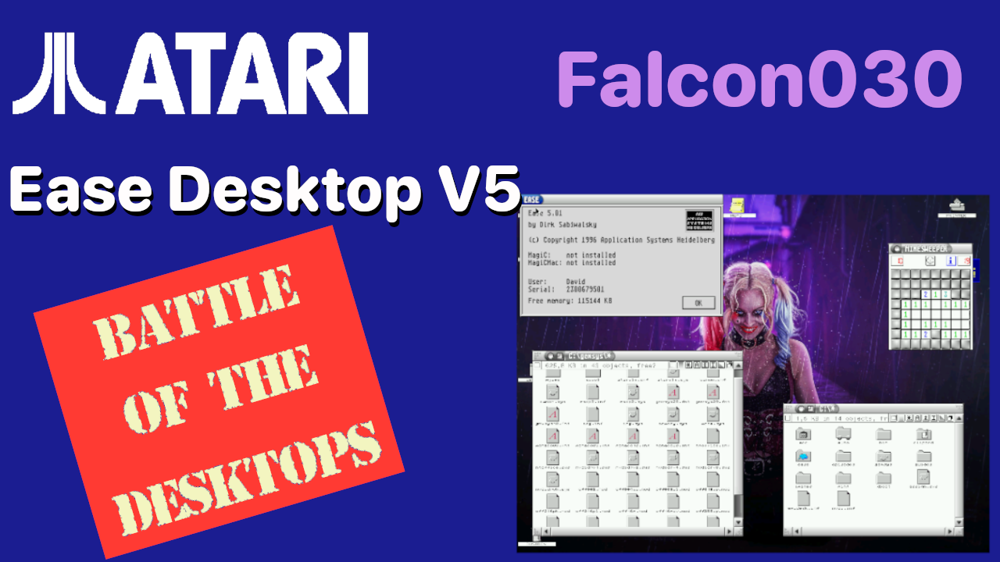
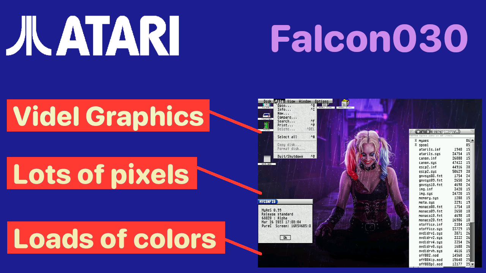
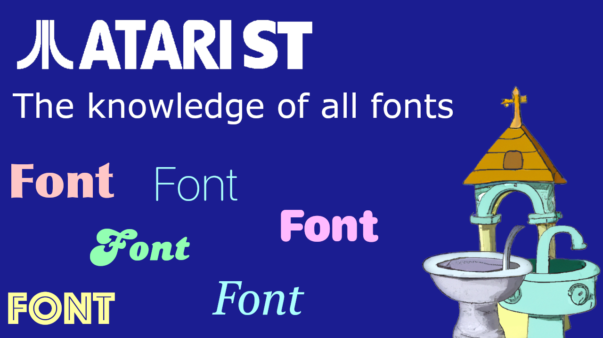

# The  HDD image for my ST From Zero to Hero Series

I've been presenting two series on YouTube around installing configuring and extending an Atari ST and an Atari Falcon.

While recording these series I've been asked if I could make the hard drive images available. This page is where I am going to host those images, or at least the last couple.

I'll try to keep this page up to date with the series, but updates might be some what asynchronous, unless I can easily automate it.

These are zip files containing a single file called `512.img` which is a 512 MB Atari ST Hard drive suitable for using in emulators. I use Hatari
for recording purposes, it boots fine in EmuTos. It almost certainly won't boot into real TOS because no HD drivers are installed.

The video describing how to use these images is available [here](https://youtu.be/WRRTCyj7Xfs)

The images for the falcon series require a slightly tweaked process, outlined with the videos.

## Episode 28 - Polishing MiNT #1 - Unix Tools, usability and NeoDesk

If you are going 
to watch the video on [how to install and use this image](https://youtu.be/WRRTCyj7Xfs)
be aware that there are some changes you will need to make to get this to work:

- The system needs to be an Atari Falcon
- The CPU needs to be 68040 at 32 MHz (or 32 if you wish) and a 68882 FPU
- Memory I used 14 MB of ST RAM and 128 of TT/Fast RAM
- Most importantly the HDD image needs to be mounted as an IDE drive (I think SCSI works to and is faster , but at the moment I use IDE)

Also as I noted in the video, GEMDOS drives are not available in MiNT

    <a href="{{ site.baseurl }}/hdd/ep_028_hdd_img.zip" class="downloadLink" >Download DISK Image </a>

## Episode 27 - Battle of the desktops: Jinnee Desktop 

This HDD image extends the previous one and adds a Fourth desktop: Jinnee, plus new XBoot sets to
boot directly into it and the others.

In this video I modified the way that desktop.cnf is selected, I removed the copy command in the script and added an info file for it.

If you are going 
to watch the video on [how to install and use this image](https://youtu.be/WRRTCyj7Xfs)
be aware that there are some changes you will need to make to get this to work:

- The system needs to be an Atari Falcon
- The CPU needs to be 68040 at 32 MHz (or 32 if you wish) and a 68882 FPU
- Memory I used 14 MB of ST RAM and 128 of TT/Fast RAM
- Most importantly the HDD image needs to be mounted as an IDE drive (I think SCSI works to and is faster , but at the moment I use IDE)

Also as I noted in the video, GEMDOS drives are not available in MiNT

    <a href="{{ site.baseurl }}/hdd/ep_027_hdd_img.zip" class="downloadLink" >Download DISK Image </a>

## Episode 26 - Battle of the desktops: Thing Desktop 1.27

This HDD image extends the previous one and adds a third desktop: Thing 1.27, plus new XBoot sets to
boot directly into it and the others.

If you are going 
to watch the video on [how to install and use this image](https://youtu.be/WRRTCyj7Xfs)
be aware that there are some changes you will need to make to get this to work:

- The system needs to be an Atari Falcon
- The CPU needs to be 68040 at 32 MHz (or 32 if you wish) and a 68882 FPU
- Memory I used 14 MB of ST RAM and 128 of TT/Fast RAM
- Most importantly the HDD image needs to be mounted as an IDE drive (I think SCSI works to and is faster , but at the moment I use IDE)

Also as I noted in the video, GEMDOS drives are not available in MiNT

    <a href="{{ site.baseurl }}/hdd/ep_026_hdd_img.zip" class="downloadLink" >Download DISK Image </a>

## Episode 25 - Battle of the desktops: Ease V5

This HDD image extends the previous one and adds a second desktop: Ease V5, plus new XBoot sets to
boot directly into either Ease or TeraDesk.

If you are going 
to watch the video on [how to install and use this image](https://youtu.be/WRRTCyj7Xfs)
be aware that there are some changes you will need to make to get this to work:

- The system needs to be an Atari Falcon
- The CPU needs to be 68040 at 32 MHz (or 32 if you wish) and a 68882 FPU
- Memory I used 14 MB of ST RAM and 128 of TT/Fast RAM
- Most importantly the HDD image needs to be mounted as an IDE drive (I think SCSI works to and is faster , but at the moment I use IDE)

Also as I noted in the video, GEMDOS drives are not available in MiNT

    <a href="{{ site.baseurl }}/hdd/ep_025_hdd_img.zip" class="downloadLink" >Download DISK Image </a>

## Episode 24 - Atari Falcon,Hatari and Videl graphics 

This HDD image extends my base MiNT install and add true colour hi-res videl graphics. I've
tweaked the system a bit and increased the true color resolution from 912x688, to 992x752.

There's also a folder on the root of the c drive that contains the two desktop images I used in this
episode, the Joker (in the video) and Harly Quinn from the thumbnail (and in use on this image).

You can swap between them by dragging the desk.png image in to the u:\c\gemsys\myaes\skins\default
folder. Remember to do this in the EmuTOS desktop, not the mint one.

If you are going 
to watch the video on [how to install and use this image](https://youtu.be/WRRTCyj7Xfs)
be aware that there are some changes you will need to make to get this to work:

- The system needs to be an Atari Falcon
- The CPU needs to be 68040 at 32 MHz (or 32 if you wish) and a 68882 FPU
- Memory I used 14 MB of ST RAM and 128 of TT/Fast RAM
- Most importantly the HDD image needs to be mounted as an IDE drive (I think SCSI works to and is faster , but at the moment I use IDE)

Also as I noted in the video, GEMDOS drives are not available in MiNT

    <a href="{{ site.baseurl }}/hdd/ep_024_hdd_img.zip" class="downloadLink" >Download DISK Image </a>

## Episode 23 - How to install and configure MiNT in 2023 

This HDD image contains my initial MiNT install. If you are going to watch the video on [how to install and use this image](https://youtu.be/WRRTCyj7Xfs)
be aware that there are some changes you will need to make to get this to work:

- The system needs to be an Atari Falcon
- The CPU needs to be 68030 at 16 MHz (or 32 if you wish) and a 68882 FPU
- Memory I used 14 MB of ST RAM and 128 of TT/Fast RAM
- Most importantly the HDD image needs to be mounted as an IDE drive (I think SCSI works to and is faster , but at the moment I use IDE)

Also as I noted in the video, GEMDOS drives are not available in MiNT

    <a href="{{ site.baseurl }}/hdd/ep_023_hdd_img.zip" class="downloadLink" >Download DISK Image </a>

## Episode 19 - The knowledge of all fonts

This is the HDD image from the end of this video with one addition. I set an icon for the font directories to make them look better.

    <a href="{{ site.baseurl }}/hdd/ep_019_hdd_img.zip" class="downloadLink" >Download DISK Image </a>

## Episode 17 - You're So Pretty

    <a href="{{ site.baseurl }}/hdd/ep_017_hdd_img.zip" class="downloadLink" >Download DISK Image </a>

## Episode 16 - Help Me Obi Wan

    <a href="{{ site.baseurl }}/hdd/ep_016_hdd_img.zip" class="downloadLink" >Download DISK Image </a>

---

