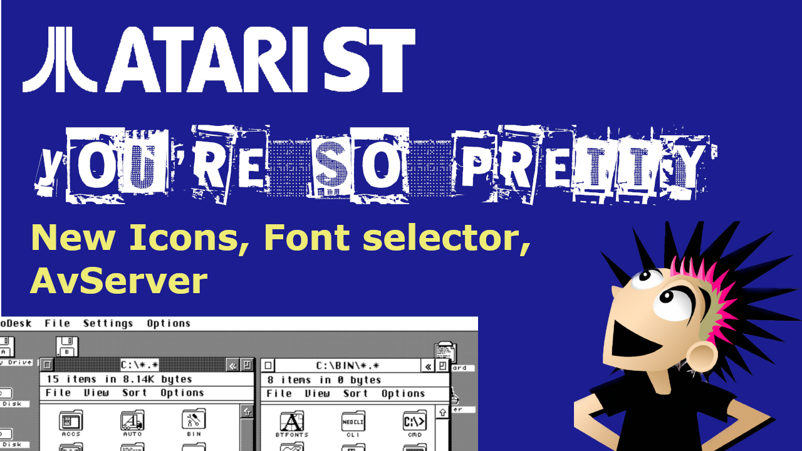
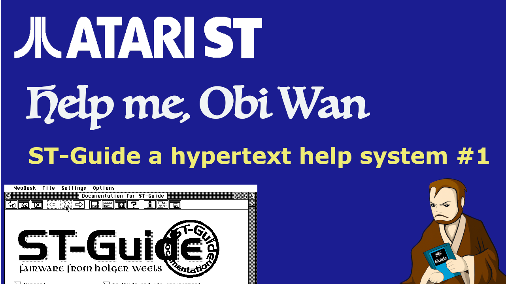

# The  HDD image for my ST From Zero to Hero Series

I've been presenting a series on YouTube called from from Zero to Hero where I take a base line ATARI ST-FM and
configure it into a power house of a productivity machine.

While recording this series I've been asked if I could make the hard drive images available. This page is where I am going to host those images, or at least the last couple.

I'll try to keep this page up to date with the series, but updates might be some what asynchronous, unless I can easily automate it.

These are zip files containing a single file called `512.img` which is a 512 MB Atari ST Hard drive suitable for using in emulators. I use Hatari
for recording purposes, it boots fine in EmuTos. It almost certainly won't boot into real TOS because no HD drivers are installed.

## Episode 17 - You're So Pretty

    <a href="{{ site.baseurl }}/hdd/ep_017_hdd_img.zip" class="downloadLink" >Download DISK Image </a>

## Episode 16 - Help Me Obi Wan

    <a href="{{ site.baseurl }}/hdd/ep_016_hdd_img.zip" class="downloadLink" >Download DISK Image </a>

## Episode 15 - Raiders of the lost ARC

    <a href="{{ site.baseurl }}/hdd/ep_015_hdd_img.zip" class="downloadLink" >Download DISK Image </a>

---

