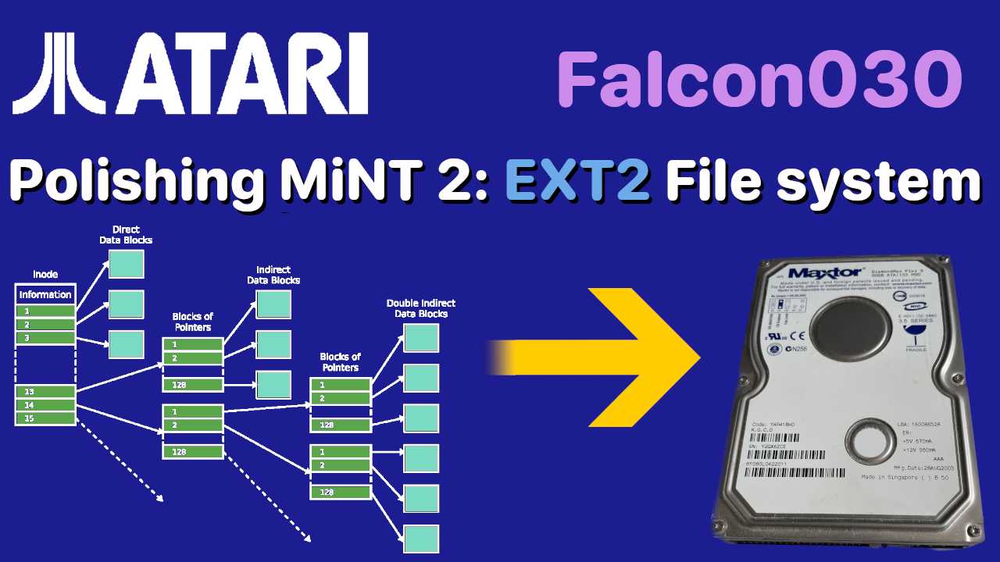

# The  HDD image for my ST From Zero to Hero Series

I've been presenting two series on YouTube around installing configuring and extending an Atari ST and an Atari Falcon.

While recording these series I've been asked if I could make the hard drive images available. This page is where I am going to host that image.

The current image will contain all that was covered in all previous ones

I'll try to keep this page up to date with the series, but updates might be some what asynchronous, unless I can easily automate it.

This is a zip file containing a single file called `512.img` which is a 512 MB Atari ST Hard drive suitable for using in emulators. I use Hatari for recording purposes, it boots fine in EmuTos. It almost certainly won't boot into real TOS because no HD drivers are installed.

There are two Hard drive images that are available, these are for the Atari ST image and the Falcon Image.

The video describing how to use these images is available [here](https://youtu.be/WRRTCyj7Xfs) though it's getting very out of date. 

If you're interested in the ST image, it's at the end of the page.

If you are going to watch the video on [how to install and use the  ST image](https://youtu.be/WRRTCyj7Xfs) it covers the ST version

If you are following the Atari Falcon / Mint series see the extra instructions below before watching that video

## Episode 29 - Polishing Mint #2: Adding an Ext2 file system to MiNT

- The system needs to be an Atari Falcon
- The CPU needs to be 68040 at 32 MHz (or 32 if you wish) and a 68882 FPU
- Memory I used 14 MB of ST RAM and 128 of TT/Fast RAM
- There are now two hard drive images that need to be used.
    - The file drive-0.img should be mounted as SCSI device 0 
    - and drive-1.img as SCSI device 1
- finally the drives are now packed as bzip2 compressed tar files, use
    - tar xvjf file.tar.bz2 _On MAC and Linux_
    - 7zip _on windows_ or the above command on _WSL_

Also as I noted in the video, GEMDOS drives are not available in MiNT

    <a href="https://www.dropbox.com/scl/fi/s8rx9e8pc2qk5hdvsq2cc/ep-029-hdd-images.tar.bz2?rlkey=bm1m141q4l8x1zb87tzpfhyaf&dl=1" class="downloadLink" >Download DISK Image </a>

## THe Atrai ST image 

This is the '512.img' file from the original ST from hero to zero series

    <a href="https://www.dropbox.com/scl/fi/xpcmrwevwayxzu6y9pvk9/ep_019_hdd_img.zip?rlkey=wnmc6jm8799np5f5u05fix4uq&dl=1" class="downloadLink" >Download DISK Image </a>

---

