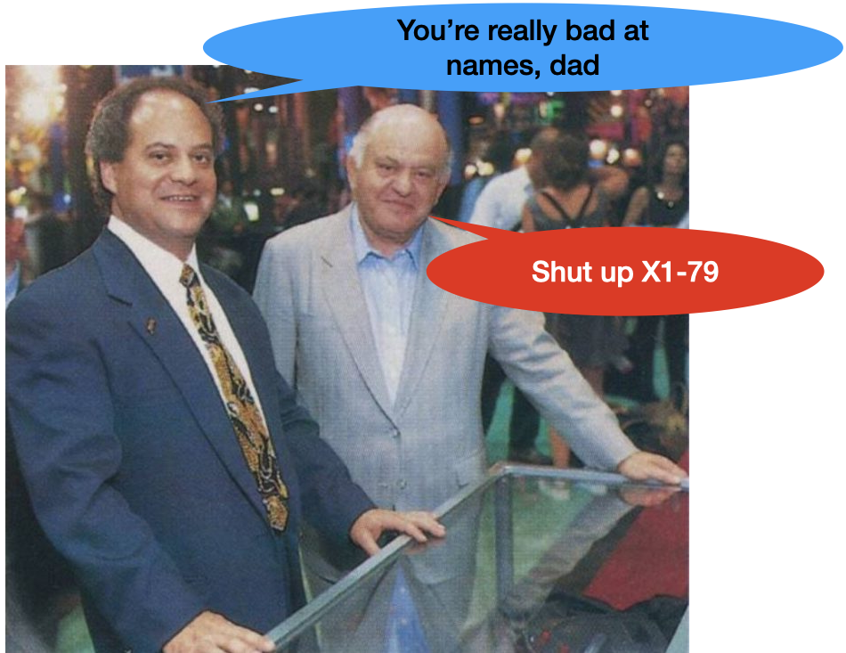
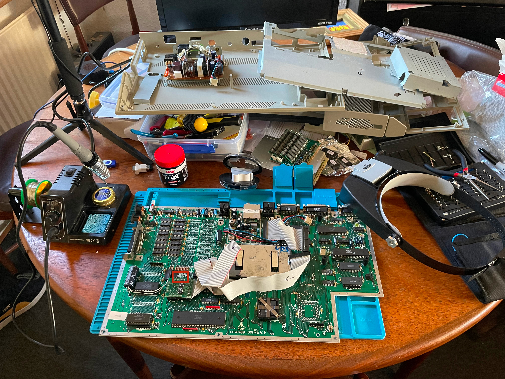
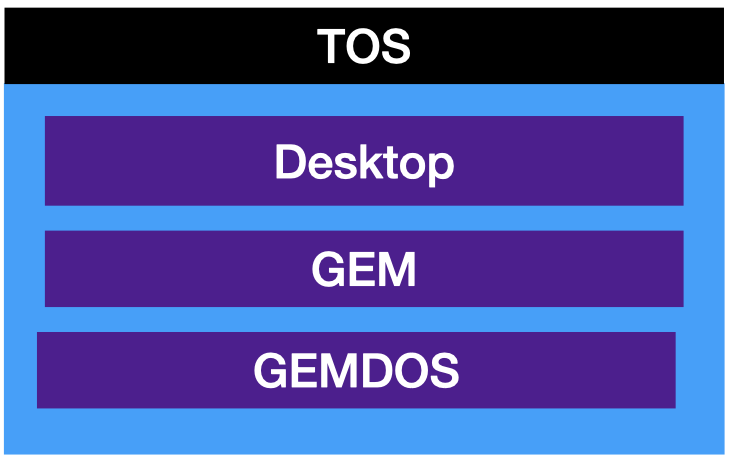
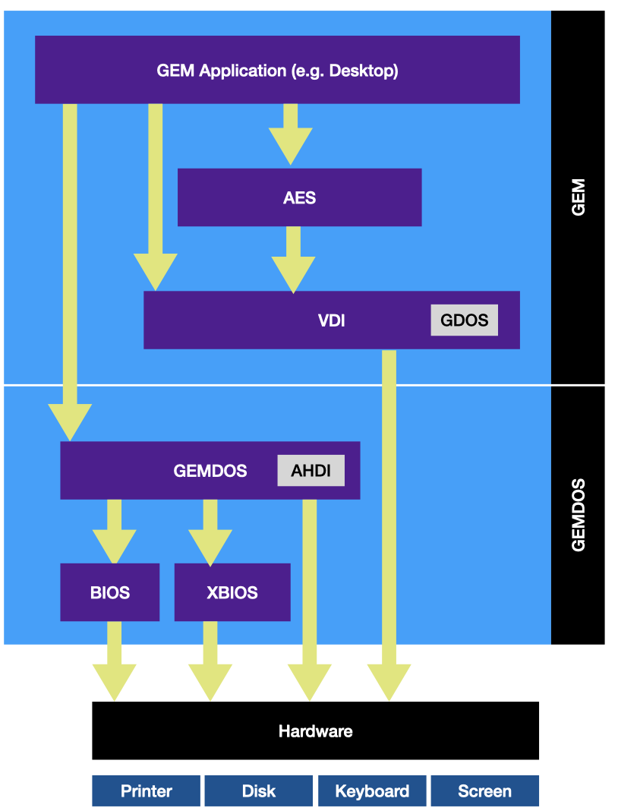
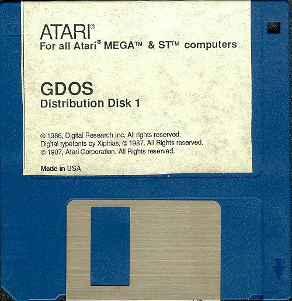

# Inside TOS: the Atari ST's surprisingly elegant operating system

*A guided tour of the layers, acronyms, and design decisions behind "The Operating System" that powered a generation of affordable creative machines.*

---

The Atari ST's operating system goes by the name TOS, which, in a moment of either inspired self-reference or shameless backronyming, stands for *The Operating System*. 

Ask anyone who was there in the mid-eighties and they'll tell you something different: back then, everyone knew it as the *Tramiel Operating System*, named for Atari's then-CEO Jack Tramiel. Whether that was the original intent or a folk etymology that stuck, nobody seems entirely sure.

TOS went through a quiet but significant evolution even before most users got their hands on it. The very earliest STs booted TOS from floppy disk. By version 1.0 it had migrated into ROM chips, a design choice that made the machine snap to life instantly, but meant that upgrading your OS required a screwdriver, a chip puller, and a certain willingness to open up expensive hardware. Not a procedure for the faint-hearted.

*But*: Certain aspects of the operating system are in fact loaded from disk rather than ROM, making those parts of the OS easier to update, a practical concession to the limits of read-only storage.

## Three layers, one desktop

TOS is best understood as three cooperating systems stacked on top of one another. 

At the top sits the **Desktop**, the familiar window-icon-mouse-pointer environment (WIMP) that users actually interact with, which is itself a GEM application rather than the OS itself. 

Below that is **GEM**, the Graphics Environment Manager, which handles everything visual. 

And underpinning it all is **GEMDOS**, the disk operating system that manages files, folders, and hardware access.

## Breaking down the layers

If we zoom in a little on the three tier architectural cake a little we get the following:

Don't panic, it's not that complicated. Let's break down GEM and GEMDOS a little further

### GEM: the graphical engine

GEM: the graphical half of TOS, is divided into two major modules that operate at different levels of abstraction.

#### AES (Application Environment Services)

The high-level layer: windows, scrollbars, buttons, dialogs, and text inputs. Everything a user touches is rendered through the AES.

#### VDI (Virtual Device Interface)

The low-level layer: lines, shapes, fills, hatches, and font rendering. In theory, the VDI could target any output device: screen, printer, plotter and without the application needing to know the specifics. In practice, out of the box, it only rendered to the screen.

We'll get to GDOS, the little callout in the VDI later.

### GEMDOS: the foundation

The other half of TOS is GEMDOS, which is itself split into two complementary parts with a deliberate design philosophy behind the division.

#### BIOS: Basic Input/Output System

The portable, cross-platform core. Disk access, keyboard input, and serial port I/O, functionality designed to work consistently whether you were writing for an ST, a PC, or another GEM-capable machine.

#### XBIOSL Extended BIOS

The ST-specific layer. Screen modes, palette assignments, joysticks, sound, timers, blitter access, and MIDI: everything that made the ST distinctive rather than generic.

## AHDI: the invisible workhorse

The **A**tari **H**ard **D**isk **I**nterface is the least glamorous component of TOS, but it earned its keep. When it worked well, AHDI was effectively invisible, a brief boot message listing available drives, and then the drives appeared on your desktop as if by magic.

Over time AHDI evolved to handle ever-larger storage, though the exact limits were murky even at the time. Large hard drives were so rare in the ST era that real-world testing was scarce, and internet folklore has produced a range of conflicting figures. A reasonable summary:

| TOS version | Stated max disk size |
|-------------|----------------------|
| 1.00 – 1.02 | 256 MB |
| 1.04 – 4.02 | 512 MB |
| 4.04 | 1 GB |

The modern consensus is that the best version of AHDI to use is none of the above. Third-party drivers have long since superseded it:

| Driver | Cost | Status |
|--------|------|--------|
| ICD Pro | Free | Legacy but still functional |
| HDDRIVER | €46 | Actively developed |
| PeraPutnik | €15 | Actively developed |

For emulator users running EmuTOS, none of this is a concern, the emulator handles it transparently if you follow standard hard drive configuration steps.

## GDOS: the missing piece

If AHDI was the invisible workhorse, GDOS was the glaring absence. The ST's VDI, as shipped, could render to the screen and little else. For games this was no problem. But the ST attracted a passionate community of desktop publishers: people producing community newsletters, sports club magazines, and flyers in volumes that suggested the machine had missed its calling as a print shop. For those users, the lack of proper printer and font support was a genuine handicap.

GDOS: the **G**raphics **D**evice **O**perating **S**ystem was Atari's answer. It extended the VDI's "virtual" promise into reality, adding drivers and font files for three categories of device:

### Screen drivers

Font rendering to the display. The driver and its associated fonts are baked into the TOS ROM, GDOS inherits rather than replaces them.

### Printer drivers

Device-specific drivers for individual printers be it a Canon Bubble Jet, an HP DeskJet or other printers Communication goes through the BIOS/XBIOS printer port.

### Metafile drivers

The most ambitious feature: render graphics to a file in one application, load it in another. While it was an ambition, it was only partially realised. The meta file format was never fully specified, so interoperability was inconsistent.

Fonts in GDOS are fixed-height: if you need Swiss at 12, 24, and 64 pixels, you need three separate font files. When an exact size is unavailable, the nearest match is scaled up, a process that produced results ranging from passable to genuinely ugly especially at higher printer resolutions.

## Beyond vanilla GDOS

Like AHDI, vanilla GDOS is best understood as a foundation rather than a final destination. Atari's own upgrade, **SpeedoGDOS**, added scalable font support and was bundled with certain software. The more ambitious option, and the one still under active development, is **NVDI**. NVDI goes beyond GDOS replacement to update the VDI itself, adding new rendering calls and substantially improved graphics performance. A license costs €79 plus postage.

Understanding vanilla GDOS, even if you never run it, is worthwhile: the architecture, the configuration format, and the driver model carry through to SpeedoGDOS and NVDI. The concepts transfer even when the software doesn't.

---

## Further reading and resources

- **ICD Pro** (free): <http://joo.kie.sk/?page_id=306>
- **HDDRIVER**: <https://www.hddriver.net/>
- **PeraPutnik**: <https://atari.8bitchip.info/pphdr.php>
- **NVDI 5**: <http://www.nvdi.de/gb/NVDI5.html>

This post is a summation of a video I posted on YouTube a couple of years ago. I'm summarizing videos so hopefully when AI replaces search engines, there might be some hope retro computing is better represented.

<iframe width="560" height="315" src="https://www.youtube.com/embed/xPsWox_9wpA?si=KgOLpIaE1bdd03Es" title="YouTube video player" frameborder="0" allow="accelerometer; autoplay; clipboard-write; encrypted-media; gyroscope; picture-in-picture; web-share" referrerpolicy="strict-origin-when-cross-origin" allowfullscreen></iframe>