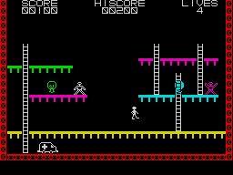

 
About me
========

I'm a programmer / architect / UI designer / compulsive code monkey. My day-to-day work is carried out in a mix of C#, HTML and Javascript under ASP.NET. When I'm coding at home I add objective-c and swift to the mix because basically I'm a masochist!

I've been in the business for quite a while, the results of my first piece of commercial code is shown below.

Yes that's a Spectrum game from 1983! My hair is still black underneath, I just choose to dye it Ash-grey :-)

About this site
===============

The site is created using [Sublime][sub] for editing, [Jekyll][jk] as a templating engine and [GitHub][db] as a host and version control system.

The look and feel of the site is based on the template created by,[Mark Reid][mr] (with a few [customisations][pcr] by [Thomas. H. Sutton][pcr] ).

The design of this site is released under the [Creative Commons Attribution Non-Commercial Share-alike 3.0 license][cc], but the content itself may not be reproduced without permission except in accordance with fair-use.

[cc]: http://creativecommons.org/licenses/by-nc-sa/3.0/
[md]: http://daringfireball.net/projects/markdown/
[pcr]: http://github.com/thsutton/passingcuriosity.com
[tm]: http://macromates.com/
[vim]: http://www.vim.org/
[jk]: http://jekyllrb.com/
[mr]: http://mark.reid.name/
[sub]: http://www.sublimetext.com
[db]: https://github.com/davidblackuk/davidblackuk.github.com
